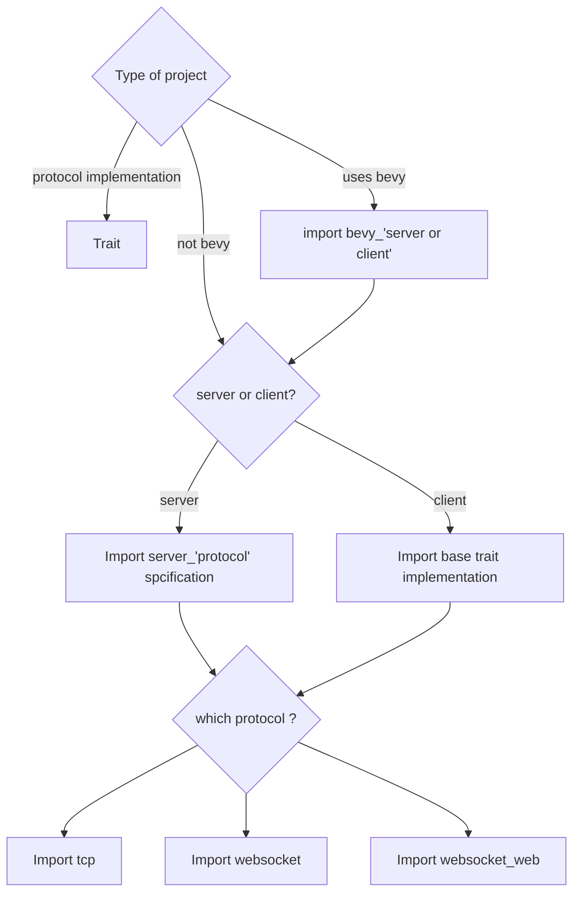

# Goals

Making multiplayer games should be as easy as:
- "connect"
- "send data"
- "receive data"

This library is an attempt to :
- Hide low level stuff
- Be modular enough to support multiple protocols or platforms

## Modularity

- **a common core** trait in `litlnet_trait`
- **base implementation** of that *common core* for popular protocols using libraries in `litlnet_tcp`, `litlnet_websocket`
- **server implementation** leveraging the *base implementation* in `litlnet_tcp_server`, `litlnet_websocket_server`
- **bevy bridges**: compatible with any *base implementation* in `litlnet_client_bevy` and `litlnet_server_bevy`
- **short examples** in `example_*`

# (very) WIP

- support browser: see ./crates/example_client_web/Readme.md

